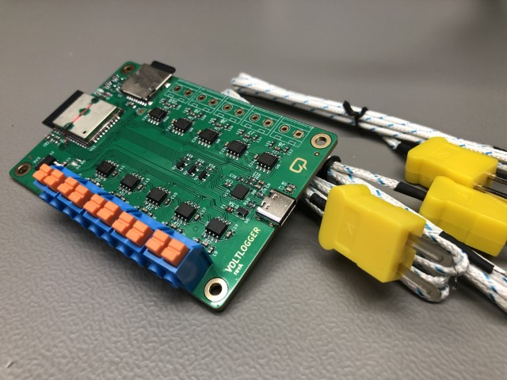

# Voltlogger
This repository contains the source files for the Voltlogger, a 10 channel thermocouple data logger built around the ESP32 and the MAX31855 thermocouple interface chip. This project was shown in Voltlog #368.

## Known bugs in revA
Schematic constains a bug, where IO34 & IO35 are connected to chip select signals for thermocouple interface chips #1 and #2. These pins are input only on the ESP32 so they cannot drive the CS pis on Th1 & Th2. The workaround is to connect these CS pins to IO22 and IO23. ESD protection diodes seem to be causing signal integrity issues on the SD card interface so leave those unpopulated until this issue is debugged further.

More info about this project in [Voltlog #368](https://youtu.be/YB1_f1XHdw0).
If you would like to order one of these boards ready assembled, check out my [Tindie store](https://www.tindie.com/products/voltlog/voltlogger-10-channel-thermocouple-data-logger/).

